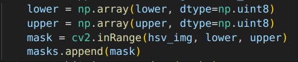
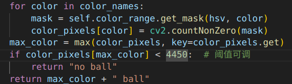
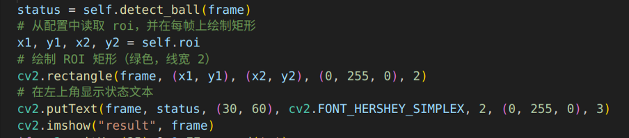

整体架构
使用面向对象设计，包含ColorRange和BallDetector两个核心类

通过配置文件管理参数，提高代码灵活性

核心处理流程
1. 颜色范围处理 (ColorRange类)
从配置文件中遍历不同颜色的HSV范围
使用cv2.inRange()创建颜色掩码，并通过位或操作合并多个范围  

2. 球体检测 (BallDetector类)

区域截取：只处理ROI（小球区域）内的图像
，将颜色空间转换BGR → HSV，更适合颜色分割，对红、蓝、紫三种颜色的掩码分别计算像素数量,找到像素数量最多的颜色，如果最大像素数低于阈值(4300)，判定为"无球"，否则返回检测到的颜色

3. 视频处理
每帧进行球体检测,绘制ROI区域绿色边框,在左上角显示检测状态

技术特点
模块化设计：颜色处理和检测逻辑分离,颜色范围、ROI区域、阈值等均可通过配置文件调整,能够实时处理视频流并显示结果

遇到的问题：掩码的组合操作想不出来，求助了ai。函数使用的数据类型对不上。。json文件的格式不太会用，调取数据操作不理解。
